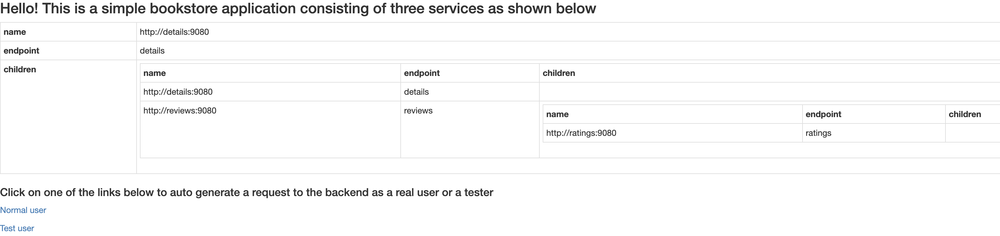

# Overview

The [Bookinfo](https://istio.io/latest/docs/examples/bookinfo) application displays information about a book, similar to a single catalog entry of an online book store. Displayed on the page is a description of the book, book details (ISBN, number of pages, and so on), and a few book reviews.

The `Bookinfo` application is broken into four separate microservices:

- `productpage` - calls the details and reviews microservices to populate the page.
- `details` - contains book information.
- `reviews` - contains book reviews. It also calls the ratings microservice.
- `ratings` - contains book ranking information that accompanies a book review.

Please visit the [Bookinfo application](https://istio.io/latest/docs/examples/bookinfo) documentation page for more details.

## Requirements

To complete all steps and deploy the `Bookinfo` sample application, you will need:

1. A [DOKS](https://docs.digitalocean.com/products/kubernetes/quickstart) cluster configured and running.
2. Latest [Kubectl](https://kubernetes.io/docs/tasks/tools/#kubectl) version for Kubernetes interaction.
3. [Git](https://git-scm.com/downloads) client for interacting with the [kubernetes-sample-apps](https://github.com/digitalocean/kubernetes-sample-apps) repository.

## Deploying to Kubernetes

The [kustomization manifest](kustomize/kustomization.yaml) provided in this repository will get you started with deploying the `Bookinfo` application Kubernetes resources.

First, you need to clone this repository:

```shell
git clone https://github.com/digitalocean/kubernetes-sample-apps.git
```

Then, change directory to your local copy:

```shell
cd kubernetes-sample-apps
```

Now, create Bookinfo sample application Kubernetes resources using the kubectl kustomize option (`-k` flag):

```shell
kubectl apply -k bookinfo-example/kustomize
```

The output looks similar to:

```text
namespace/bookinfo created
serviceaccount/bookinfo-details created
serviceaccount/bookinfo-productpage created
serviceaccount/bookinfo-ratings created
serviceaccount/bookinfo-reviews created
service/details created
service/productpage created
service/ratings created
service/reviews created
deployment.apps/details-v1 created
deployment.apps/productpage-v1 created
deployment.apps/ratings-v1 created
deployment.apps/reviews-v1 created
deployment.apps/reviews-v2 created
deployment.apps/reviews-v3 created
```

If everything went well, you should have a new Kubernetes namespace created named `bookinfo`. Inside the new namespace, you can inspect all resources created by the kustomization manifest from the sample apps repository (all Bookinfo application pods should be up and running):

```shell
kubectl get all -n bookinfo
```

The output looks similar to:

```text
NAME                                  READY   STATUS    RESTARTS   AGE
pod/details-v1-7694bf8b6f-zgdts       1/1     Running   0          82m
pod/productpage-v1-659d8f84c9-cr446   1/1     Running   0          82m
pod/ratings-v1-65785878bf-7kr2h       1/1     Running   0          82m
pod/reviews-v1-b98448d4f-zrfbd        1/1     Running   0          82m
pod/reviews-v2-867f95557c-shsw9       1/1     Running   0          81m
pod/reviews-v3-7c769464df-gbv5x       1/1     Running   0          81m

NAME                  TYPE        CLUSTER-IP       EXTERNAL-IP   PORT(S)    AGE
service/details       ClusterIP   10.245.223.202   <none>        9080/TCP   82m
service/productpage   ClusterIP   10.245.139.105   <none>        9080/TCP   82m
service/ratings       ClusterIP   10.245.229.118   <none>        9080/TCP   82m
service/reviews       ClusterIP   10.245.227.244   <none>        9080/TCP   82m

NAME                             READY   UP-TO-DATE   AVAILABLE   AGE
deployment.apps/details-v1       1/1     1            1           82m
deployment.apps/productpage-v1   1/1     1            1           82m
deployment.apps/ratings-v1       1/1     1            1           82m
deployment.apps/reviews-v1       1/1     1            1           82m
deployment.apps/reviews-v2       1/1     1            1           82m
deployment.apps/reviews-v3       1/1     1            1           82m

NAME                                        DESIRED   CURRENT   READY   AGE
replicaset.apps/details-v1-7694bf8b6f       1         1         1       82m
replicaset.apps/productpage-v1-659d8f84c9   1         1         1       82m
replicaset.apps/ratings-v1-65785878bf       1         1         1       82m
replicaset.apps/reviews-v1-b98448d4f        1         1         1       82m
replicaset.apps/reviews-v2-867f95557c       1         1         1       82m
replicaset.apps/reviews-v3-7c769464df       1         1         1       82m
```

Finally, port-forward the `productpage` service using `kubectl`:

```shell
kubectl port-forward service/productpage -n bookinfo 9080:9080
```

Open a web browser and point to [localhost:9080](http://localhost:9080/). You should see the `productpage` service welcome page:



## Cleaning Up

To clean up all Kubernetes resources created by the Bookinfo sample application, below command must be used:

```shell
kubectl delete ns bookinfo
```

**Note:**

Kubectl kustomize subcommand has a delete option that can be used - `kubectl delete -k bookinfo-example/kustomize`. But, it won't work well in this case because if the namespace is deleted first then the remaining operations will fail.
