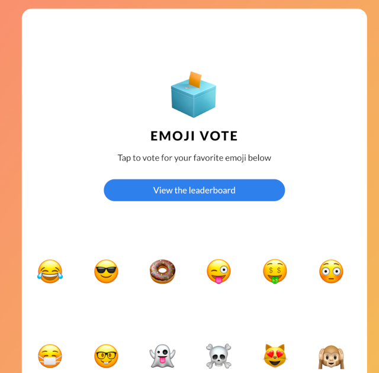

# Overview

[Emojivoto](https://github.com/BuoyantIO/emojivoto) is a microservice application that allows users to vote for their favorite emoji, and tracks votes received on a leaderboard. May the best emoji win.

The application is composed of the following 3 services:

* [emojivoto-web](https://github.com/BuoyantIO/emojivoto/tree/main/emojivoto-web): Web frontend and REST API.
* [emojivoto-emoji-svc](https://github.com/BuoyantIO/emojivoto/tree/main/emojivoto-emoji-svc): gRPC API for finding and listing emoji.
* [emojivoto-voting-svc](https://github.com/BuoyantIO/emojivoto/blob/main/emojivoto-voting-svc): gRPC API for voting and leaderboard.

Please visit the [Emojivoto](https://github.com/BuoyantIO/emojivoto) documentation page for more details.

## Requirements

To complete all steps and deploy the `Emojivoto` sample application, you will need:

1. A [DOKS](https://docs.digitalocean.com/products/kubernetes/quickstart) cluster configured and running.
2. Latest [Kubectl](https://kubernetes.io/docs/tasks/tools/#kubectl) version for Kubernetes interaction.
3. [Git](https://git-scm.com/downloads) client for interacting with the [kubernetes-sample-apps](https://github.com/digitalocean/kubernetes-sample-apps) repository.

## Deploying to Kubernetes

The [kustomization manifest](kustomize/kustomization.yaml) provided in this repository will get you started with deploying the `Emojivoto` application Kubernetes resources.

First, you need to clone this repository:

```shell
git clone https://github.com/digitalocean/kubernetes-sample-apps.git
```

Then, change directory to your local copy:

```shell
cd kubernetes-sample-apps
```

Now, create Emojivoto sample application Kubernetes resources using the kubectl kustomize option (`-k` flag):

```shell
kubectl apply -k emojivoto-example/kustomize
```

The output looks similar to:

```text
namespace/emojivoto created
serviceaccount/emoji created
serviceaccount/voting created
serviceaccount/web created
service/emoji-svc created
service/voting-svc created
service/web-svc created
deployment.apps/emoji created
deployment.apps/vote-bot created
deployment.apps/voting created
deployment.apps/web created
```

If everything went well, you should have a new Kubernetes namespace created named `emojivoto`. Inside the new namespace, you can inspect all resources created by the kustomization manifest from the sample apps repository (all Emojivoto application pods should be up and running):

```shell
kubectl get all -n emojivoto
```

The output looks similar to:

```text
NAME                            READY   STATUS    RESTARTS   AGE
pod/emoji-84cd97f89b-cpz4l      1/1     Running   0          10m
pod/vote-bot-5b587bbff7-wqv8t   1/1     Running   0          10m
pod/voting-74ff7f8b55-5wbgt     1/1     Running   0          10m
pod/web-7dfbdc8bf5-247t9        1/1     Running   0          9m59s

NAME                 TYPE        CLUSTER-IP       EXTERNAL-IP   PORT(S)             AGE
service/emoji-svc    ClusterIP   10.245.140.136   <none>        8080/TCP,8801/TCP   10m
service/voting-svc   ClusterIP   10.245.217.36    <none>        8080/TCP,8801/TCP   10m
service/web-svc      ClusterIP   10.245.137.75    <none>        80/TCP              10m

NAME                       READY   UP-TO-DATE   AVAILABLE   AGE
deployment.apps/emoji      1/1     1            1           10m
deployment.apps/vote-bot   1/1     1            1           10m
deployment.apps/voting     1/1     1            1           10m
deployment.apps/web        1/1     1            1           10m

NAME                                  DESIRED   CURRENT   READY   AGE
replicaset.apps/emoji-84cd97f89b      1         1         1       10m
replicaset.apps/vote-bot-5b587bbff7   1         1         1       10m
replicaset.apps/voting-74ff7f8b55     1         1         1       10m
replicaset.apps/web-7dfbdc8bf5        1         1         1       10m
```

Finally, port-forward the `web-svc` service using `kubectl`:

```shell
kubectl port-forward service/web-svc -n emojivoto 8080:80
```

Open a web browser and point to [localhost:8080](http://localhost:8080/). You should see the Emojivoto application welcome page:



## Cleaning Up

To clean up all Kubernetes resources created by the Emojivoto sample application, below command must be used:

```shell
kubectl delete ns emojivoto
```

**Note:**

Kubectl kustomize subcommand has a delete option that can be used - `kubectl delete -k emojivoto-example/kustomize`. But, it won't work well in this case because if the namespace is deleted first then the remaining operations will fail.
