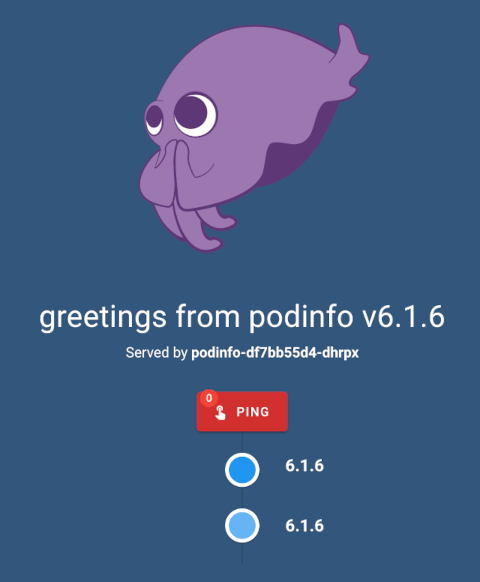

# Overview

[Podinfo](https://github.com/stefanprodan/podinfo) is a tiny web application made with Go that showcases best practices of running microservices in Kubernetes. Podinfo is used by CNCF projects like [Flux](https://github.com/fluxcd/flux2) and [Flagger](https://github.com/fluxcd/flagger) for end-to-end testing and workshops.

Specifications:

- Health checks (readiness and liveness).
- Graceful shutdown on interrupt signals.
- File watcher for secrets and configmaps.
- Instrumented with Prometheus and Open Telemetry.
- Structured logging with zap.
- 12-factor app with viper.
- Fault injection (random errors and latency).
- Swagger docs.
- CUE, Helm and Kustomize installers.
- End-to-End testing with Kubernetes Kind and Helm.
- Kustomize testing with GitHub Actions and Open Policy Agent.
- Multi-arch container image with Docker buildx and Github Actions.
- Container image signing with Sigstore cosign.
- CVE scanning with Trivy.

Please visit the [Podinfo](https://github.com/stefanprodan/podinfo) documentation page for more details.

## Requirements

To complete all steps and deploy the `Podinfo` sample application, you will need:

1. A [DOKS](https://docs.digitalocean.com/products/kubernetes/quickstart) cluster configured and running.
2. Latest [Kubectl](https://kubernetes.io/docs/tasks/tools/#kubectl) version for Kubernetes interaction.
3. [Git](https://git-scm.com/downloads) client for interacting with the [kubernetes-sample-apps](https://github.com/digitalocean/kubernetes-sample-apps) repository.

## Deploying to Kubernetes

The [kustomization manifest](kustomize/kustomization.yaml) provided in this repository will get you started with deploying the `Podinfo` application Kubernetes resources.

First, you need to clone this repository:

```shell
git clone https://github.com/digitalocean/kubernetes-sample-apps.git
```

Then, change directory to your local copy:

```shell
cd kubernetes-sample-apps
```

Now, create Podinfo sample application Kubernetes resources using the kubectl kustomize option (`-k` flag):

```shell
kubectl apply -k podinfo-example/kustomize
```

The output looks similar to:

```text
namespace/podinfo created
service/podinfo created
deployment.apps/podinfo created
horizontalpodautoscaler.autoscaling/podinfo created
```

If everything went well, you should have a new Kubernetes namespace created named `podinfo`. Inside the new namespace, you can inspect all resources created by the kustomization manifest from the sample apps repository (all Podinfo application pods should be up and running):

```shell
kubectl get all -n podinfo
```

The output looks similar to:

```text
NAME                          READY   STATUS    RESTARTS   AGE
pod/podinfo-df7bb55d4-dhrpx   1/1     Running   0          107s
pod/podinfo-df7bb55d4-jhq7m   1/1     Running   0          91s

NAME              TYPE        CLUSTER-IP      EXTERNAL-IP   PORT(S)             AGE
service/podinfo   ClusterIP   10.245.152.36   <none>        9898/TCP,9999/TCP   109s

NAME                      READY   UP-TO-DATE   AVAILABLE   AGE
deployment.apps/podinfo   2/2     2            2           108s

NAME                                DESIRED   CURRENT   READY   AGE
replicaset.apps/podinfo-df7bb55d4   2         2         2       109s

NAME                                          REFERENCE            TARGETS         MINPODS   MAXPODS   REPLICAS   AGE
horizontalpodautoscaler.autoscaling/podinfo   Deployment/podinfo   <unknown>/99%   2         4         2          109s
```

Finally, port-forward the `podinfo` service using `kubectl`:

```shell
kubectl port-forward service/podinfo -n podinfo 9898:9898
```

Open a web browser and point to [localhost:9898](http://localhost:9898/). You should see the Podinfo application welcome page:



## Cleaning Up

To clean up all Kubernetes resources created by the Podinfo sample application, below command must be used:

```shell
kubectl delete ns podinfo
```

**Note:**

Kubectl kustomize subcommand has a delete option that can be used - `kubectl delete -k podinfo-example/kustomize`. But, it won't work well in this case because if the namespace is deleted first then the remaining operations will fail.
